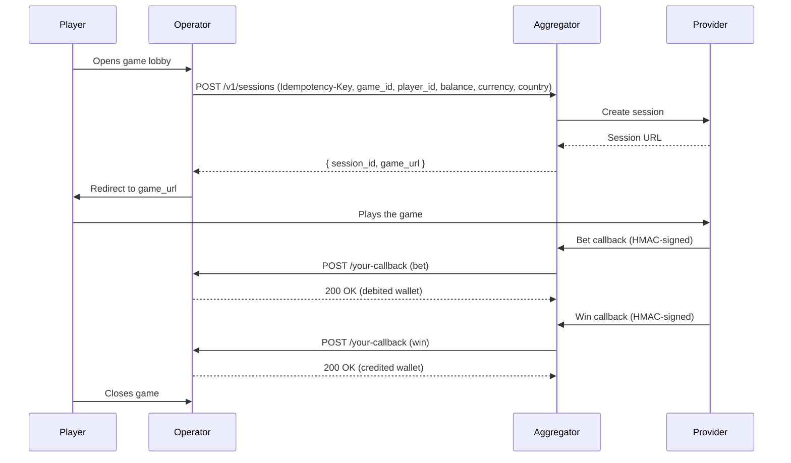

import { Steps } from '@astrojs/starlight/components';

Every game round flows through three actors: **your operator backend**, **The Aggregator**, and **the game provider**. The player sees only the game iframe; you orchestrate the wallet.

## The lifecycle

## Step-by-step

<Steps>

1. **Player opens your lobby.** Your front-end calls your backend with the game they want to play.

2. **You create a session.** `POST /v1/sessions` with an `Idempotency-Key` header and `game_id`, `player_id`, `balance`, `currency`, and `country`. The Aggregator returns `session_id` and `game_url`.

3. **You redirect the player.** The `game_url` is a short-lived (20-second) signed URL. Embed it in an iframe or redirect the browser.

4. **Provider sends bet callback.** Each spin triggers an HMAC-signed callback to your configured `callback_url`. Verify the signature, debit the player's wallet, return `200`.

5. **Provider sends win callback.** When the spin resolves, you receive a `win` callback (zero-amount wins are also delivered). Credit the player's wallet, return `200`.

6. **Player exits.** The session stays open for replays. No explicit close call needed — sessions expire automatically.

</Steps>

## Important constraints

- **`game_url` expires in 20 seconds.** Create the session immediately before redirecting the player; don't pre-fetch hours in advance.
- **Callbacks may arrive out-of-order** under network jitter. The Aggregator does best-effort ordering but cannot guarantee strict sequence. Callback dedup by `transaction_id` is on you.
- **A session can have many bets and wins.** Slot games typically generate one bet and one win per spin; live casino games can interleave them differently.
- **Failed callback (you return non-2xx) triggers retries** with exponential backoff. See [Wallet callbacks](/guides/wallet-callbacks/) for retry semantics.

## Read next

- [Integration walkthrough](/guides/integration/) — full code path
- [Wallet callbacks](/guides/wallet-callbacks/) — callback payloads and retry behaviour
- [Signature verification](/guides/signature-verification/) — HMAC verification snippets in TypeScript / PHP / Python
