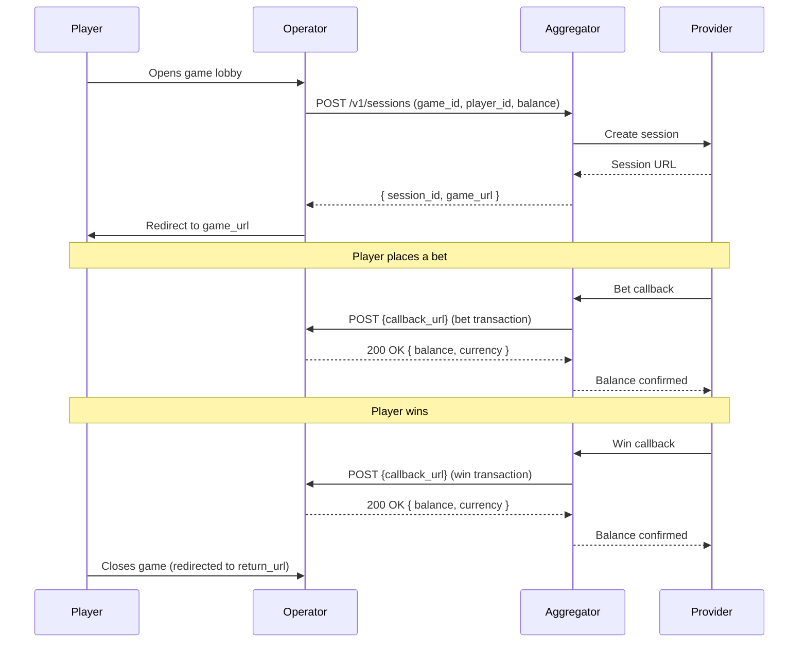

This guide walks you through integrating with The Aggregator from start to go-live. After completing the steps below, you will have a working game integration that can launch real-money sessions and process wallet callbacks.

**Time estimate**: 2--4 hours for a basic integration; 1--2 days for production-ready with full callback handling.

**Prerequisites**:
- An operator account in The Aggregator cabinet ([register here](https://app.aggregator.gg/register))
- A server that can receive HTTPS callbacks on a public URL
- Familiarity with REST APIs and webhook/callback patterns

---

## How a Game Round Works

Before you start writing code, here is the full lifecycle of a single game round. Every integration you build follows this flow.



Key points to understand:

1. **You own the wallet.** The Aggregator never holds player funds. Every bet deducts from your ledger; every win credits your ledger.
2. **Callbacks are synchronous.** The game provider waits for your response before showing the result to the player. Your callback endpoint must respond within 5 seconds.
3. **Idempotency is required.** You may receive the same callback more than once. Use the `transaction_id` to deduplicate.

---

## Step 1: Get Your Credentials

1. Register as an operator at [app.aggregator.gg/register](https://app.aggregator.gg/register).
2. Complete the KYB (Know Your Business) verification in the operator cabinet.
3. Navigate to **API Keys** in your cabinet.
4. Create your `sk_live_*` API key. This is the only key tier the platform issues — you'll use the same key for integration testing and for live customer traffic.
5. Copy the key. **It is shown once** at creation time.
6. Copy your **callback secret** from the same page. You use this to verify callback signatures.

> **Welcome credit pack**: every new operator account is provisioned with a small pool of real-money credits funded by the platform. You can run real provider sessions, receive real callbacks, and exercise the full money path before funding your own wallet. Once welcome credits are depleted, you fund the wallet through the normal billing flow. See [Environments & testing](/get-started/environments/) for details.

> **Security**: Store your API key and callback secret in environment variables or a secrets manager. Never commit them to source control. Never expose the key in browser-side code — this API is server-to-server only.

---

## Step 2: Explore the Game Catalog

Use your `sk_live_*` key to browse available games.

**Request:**

```bash
curl -X GET "https://api.aggregator.gg/v1/games?per_page=5" \
  -H "Authorization: Bearer sk_live_xxx"
```

**Response:**

```json
{
  "games": [
    {
      "id": "d4f7a2b1-3c8e-4f5a-9b6d-1e2f3a4b5c6d",
      "name": "Book of Sun",
      "provider_code": "truelabs",
      "game_type": "slots",
      "rtp": 96.5,
      "volatility": "high",
      "has_mobile": true,
      "has_desktop": true,
      "has_demo": true,
      "thumbnail_url": "https://cdn.aggregator.gg/thumbs/book-of-sun.jpg",
      "blocked_countries": ["US", "GB"],
      "features": ["free_spins", "bonus_buy"],
      "supported_currencies": ["USD", "EUR"]
    }
  ],
  "total": 142,
  "page": 1,
  "per_page": 5
}
```

**Using the SDK:**

```typescript
import { Aggregator } from "@aggregator/sdk";

const aggregator = new Aggregator({ apiKey: "sk_live_xxx" });

const { games, total } = await aggregator.games.list({
  type: "slots",
  rtp_min: 95,
  per_page: 25,
});

console.log(`Found ${total} games`);
```

You can filter by provider, game type, volatility, RTP range, features, currency, and full-text search. See the [full API reference](/api/v1/operations/listgames/) for all query parameters.

### Currency support

Every game returns `supported_currencies` — the ISO-4217 currencies it can be launched in. This is the game's own list when set, otherwise the currencies its **provider** declares (provider→game inheritance), so a game with an empty list still inherits provider support.

Use it to build a storefront that never shows a player a game their wallet currency can't open. Filter the catalog to a single currency with the `currency` query parameter:

```bash
curl -X GET "https://api.aggregator.gg/v1/games?currency=EUR" \
  -H "Authorization: Bearer sk_live_xxx"
```

Only games whose effective `supported_currencies` includes `EUR` are returned (filtered before pagination, so `total` reflects it). You can also read provider-level support directly — without paging through games — from `GET /v1/providers/registry`, where each provider carries its own `supported_currencies`.

A session launched ([Step 3](#step-3-launch-a-game)) in a currency the selected game and provider don't support can fail at launch, so filtering the catalog up front is the difference between a clean storefront and a dead-end click for the player.

---

## Step 3: Launch a Game

To launch a game for a player, create a session. The response includes a `game_url` that you redirect the player to.

**Request:**

```bash
curl -X POST "https://api.aggregator.gg/v1/sessions" \
  -H "Authorization: Bearer sk_live_xxx" \
  -H "Idempotency-Key: launch-player-42-20260402-001" \
  -H "Content-Type: application/json" \
  -d '{
    "game_id": "d4f7a2b1-3c8e-4f5a-9b6d-1e2f3a4b5c6d",
    "player_id": "player_42",
    "balance": 10000,
    "currency": "EUR",
    "country": "DE",
    "lang": "de",
    "return_url": "https://your-casino.com/lobby"
  }'
```

**Response:**

```json
{
  "session_id": "8c8e8c8e-8c8e-4c8e-8c8e-8c8e8c8e8c8e",
  "game_url": "https://games.aggregator.gg/launch/8c8e8c8e-8c8e-4c8e-8c8e-8c8e8c8e8c8e",
  "expires_in": 20,
  "provider_session_uid": "tl_session_abc",
  "provider_code": "truelabs"
}
```

**Using the SDK:**

```typescript
const session = await aggregator.sessions.create({
  game_id: "d4f7a2b1-3c8e-4f5a-9b6d-1e2f3a4b5c6d",
  player_id: "player_42",
  balance: 10000,
  currency: "EUR",
  country: "DE",
  lang: "de",
  return_url: "https://your-casino.com/lobby",
});

// Redirect the player
res.redirect(session.game_url);
```

If you need stable retries across your own queue or worker boundary, pass the
same key explicitly:

```typescript
const session = await aggregator.sessions.create(
  {
    game_id: "d4f7a2b1-3c8e-4f5a-9b6d-1e2f3a4b5c6d",
    player_id: "player_42",
    balance: 10000,
    currency: "EUR",
    country: "DE",
    lang: "de",
    return_url: "https://your-casino.com/lobby",
  },
  { idempotencyKey: "launch-player-42-20260402-001" },
);
```

**Important details:**

- `game_id` is **The Aggregator catalog UUID** — the `id` returned by `GET /v1/games`. It is **not** the provider's own game code (`provider_game_id`, for reference only). Always send The Aggregator `id`.
- `balance` is in the currency's **minor units** — the ISO-4217 minor unit, determined by the **currency** (not configurable per operator). Every currency The Aggregator currently supports is 2-decimal, so the minor unit is 1/100: `10000` = `100.00 EUR`. (A 0-decimal currency such as JPY would use whole units, but no non-2-decimal currency is enabled today.)
- `country` determines jurisdiction rules. Games blocked in the player's country return a `403`.
- `return_url` is where the player lands when they close the game. If omitted, the game closes to a blank page.
- Sessions expire after `expires_in` seconds. Create a new session if the player returns after expiry.

You can also launch demo sessions (no player credentials required):

```typescript
const demo = await aggregator.sessions.createDemo({
  game_id: "d4f7a2b1-3c8e-4f5a-9b6d-1e2f3a4b5c6d",
});
// demo.game_url opens the game in free-play mode
```

---

## Step 4: Handle Wallet Callbacks

When a player places a bet or receives a win, The Aggregator sends an HTTPS callback to the URL you configure in your operator cabinet under **Organization → Callback configuration** (one callback applies across all your providers).

### Callback format

The Aggregator sends a `POST` request with a JSON body:

```json
{
  "action": "BET-WIN",
  "transaction_type": "bet",
  "transaction_id": "tx_bet_001",
  "amount": "5.00",
  "currency": "EUR",
  "player_id": "player_42",
  "provider_code": "truelabs",
  "game": "book-of-sun",
  "game_id": "d4f7a2b1-3c8e-4f5a-9b6d-1e2f3a4b5c6d",
  "round_id": "round_abc",
  "finished": false,
  "session_id": "8c8e8c8e-8c8e-4c8e-8c8e-8c8e8c8e8c8e"
}
```

Key fields (full reference in the [wallet callbacks guide](/guides/wallet-callbacks/)):

- **Branch on `transaction_type`** (`bet` / `win` / `refund`) — not `action`, which is a provider-specific label (`"BET-WIN"`, `"BET"`, …).
- `amount` is a positive **decimal string** in major currency units (e.g. `"5.00"` = 5 EUR). Note this differs from the response `balance` below, which is in minor units (cents).
- `game_id` is The Aggregator catalog UUID; `game` is the provider's own slug.
- `finished` is `true` on the final callback of a round.

**Transaction types** (the `transaction_type` field):

| `transaction_type` | Description | Your action |
|------|-------------|-------------|
| `bet` | Player placed a bet | Deduct `amount` from the player's balance |
| `win` | Player won | Credit `amount` to the player's balance |
| `refund` | A previous bet was reversed | Credit `amount` back to the player's balance |

### Verify the signature

Every callback includes an `X-SIGNATURE` header. Verify it before processing.

The signature is an HMAC-SHA256 hex digest of the raw request body, signed with your callback secret.

```typescript
import crypto from "node:crypto";

function verifySignature(
  body: string,
  signature: string,
  secret: string,
): boolean {
  const expected = crypto
    .createHmac("sha256", secret)
    .update(body)
    .digest("hex");
  return crypto.timingSafeEqual(
    Buffer.from(signature),
    Buffer.from(expected),
  );
}
```

> **Security**: Always use `timingSafeEqual` for signature comparison to prevent timing attacks. Reject any request with an invalid or missing signature.
> HTTP sends `X-SIGNATURE`; Node exposes it as `req.headers["x-signature"]`.

### Respond correctly

Your endpoint must return **HTTP 200** with a JSON body containing `balance` **and** `currency` (both required — a balance-only body is rejected), and echo the `player_id`:

**Success (200):**

```json
{
  "balance": 9500,
  "currency": "EUR",
  "player_id": "player_42"
}
```

`balance` is the player's new balance in **minor units** (cents — e.g. `9500` = 95.00 EUR). This is a different denomination from the request `amount`, which is a major-unit decimal string (`"5.00"`). `currency` must match the request.

**Error responses:**

| Status | When to use |
|--------|-------------|
| `200` | Transaction processed successfully. Return the new balance. |
| `402` | Insufficient funds. Only valid for `bet` transactions. The bet is not placed. |
| `409` | Duplicate `transaction_id`. Return the same balance you returned for the original request. |
| `500` | Internal error. The Aggregator retries the callback. |

### Handle idempotency

You will receive the same `transaction_id` more than once if the first request times out or fails. Your handler must:

1. Check if you have already processed this `transaction_id`.
2. If yes, return the same response you returned the first time (same balance, same status).
3. If no, process the transaction and store the `transaction_id` with the result.

```typescript
app.post("/callbacks/wallet", async (req, res) => {
  // 1. Verify signature
  const sig = req.headers["x-signature"] as string;
  if (!verifySignature(req.rawBody, sig, CALLBACK_SECRET)) {
    return res.status(401).json({ error: "Invalid signature" });
  }

  const { transaction_id, transaction_type, player_id, amount, currency } = req.body;

  // 2. Check idempotency — return the SAME response for a repeated transaction_id
  const existing = await db.getTransaction(transaction_id);
  if (existing) {
    return res.json({ balance: existing.balance_after, currency, player_id });
  }

  // 3. Process transaction (branch on transaction_type, not action)
  let newBalance: number;
  if (transaction_type === "bet") {
    newBalance = await db.deductBalance(player_id, amount);
    if (newBalance < 0) {
      return res.status(402).json({ error: "Insufficient funds" });
    }
  } else {
    // win or refund — credit the amount back
    newBalance = await db.creditBalance(player_id, amount);
  }

  // 4. Store for idempotency
  await db.saveTransaction(transaction_id, { balance_after: newBalance });

  // balance in minor units (cents); currency + player_id are required/echoed.
  return res.json({ balance: newBalance, currency, player_id });
});
```

For full callback documentation, see the [wallet callbacks guide](/guides/wallet-callbacks/).

---

## Step 5: Test Your Integration

You test against the real production cluster with your `sk_live_*` key. Your **welcome credit pack** subsidises the operator wallet so you can run real provider sessions without funding it. See [Testing your integration](/guides/testing-sandbox/) for the full recommended test sequence.

### Testing checklist

- [ ] **Game catalog** -- List games and verify filtering works
- [ ] **Session creation** -- Create a session and confirm you receive a valid `game_url`
- [ ] **Demo session** -- Create a demo session and verify free-play mode works (no wallet movement)
- [ ] **Bet callback** -- Verify your endpoint deducts the correct amount and returns the updated balance
- [ ] **Win callback** -- Verify your endpoint credits the correct amount
- [ ] **Refund callback** -- Verify your endpoint reverses a bet correctly
- [ ] **Insufficient funds** -- Send a bet larger than the player's balance and confirm you return `402`
- [ ] **Idempotency** -- Send the same `transaction_id` twice and confirm you return the same response both times
- [ ] **Signature verification** -- Send a request with a tampered signature and confirm your endpoint rejects it with `401`
- [ ] **Timeout handling** -- Confirm your callback endpoint responds within 5 seconds under load
- [ ] **Blocked country** -- Attempt to create a session for a blocked country and confirm you receive `403`

### Viewing transactions

You can inspect all your transactions through the API:

```typescript
const { transactions } = await aggregator.transactions.list({
  page: 1,
  per_page: 100,
});
```

Or view them in the operator cabinet under **Transactions**.

---

## Step 6: Go Live

Once you have exercised the full callback path against welcome credits and the testing checklist is green, you are ready to open customer traffic.

### Production checklist

**API and authentication:**
- [ ] Your `sk_live_*` API key and callback secret are stored in a secrets manager, not in code
- [ ] You have a separate rotated key for CI/integration runs (do not reuse the production key)
- [ ] Your production callback URL is configured in the operator cabinet

**Callback endpoint:**
- [ ] Endpoint is publicly accessible over HTTPS (TLS 1.2+)
- [ ] Signature verification is enabled and tested
- [ ] Idempotency handling is implemented and tested
- [ ] Endpoint responds within 5 seconds under expected load
- [ ] Error responses follow the documented status codes (200, 402, 409, 500)

**Reliability:**
- [ ] Callback endpoint has monitoring and alerting configured
- [ ] You have a process for investigating and resolving failed callbacks
- [ ] Your database transactions for balance updates are atomic (no partial updates)
- [ ] You log every callback with `transaction_id`, `transaction_type`, and `amount` for reconciliation

**Compliance:**
- [ ] You respect `blocked_countries` and do not launch games for restricted jurisdictions
- [ ] Player balances are displayed in the correct currency and denomination
- [ ] You have completed KYB verification and your operator account is approved for production

**Final verification:**
- [ ] Run one real session with a small balance to confirm the full flow works in production
- [ ] Verify callback delivery by checking the transaction in both your system and the operator cabinet

---

## Further Reading

- [Full API Reference](/api/v1/operations/listgames/) -- Complete endpoint documentation with request/response schemas
- [Wallet Callback Guide](/guides/wallet-callbacks/) -- Detailed callback specification, retry behavior, and edge cases
- TypeScript SDK — distributed via your account contact
